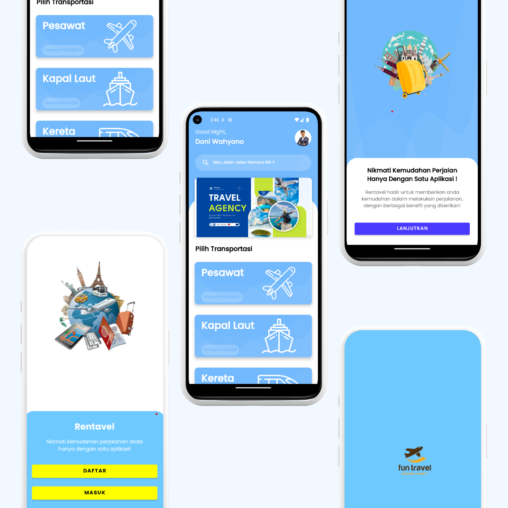
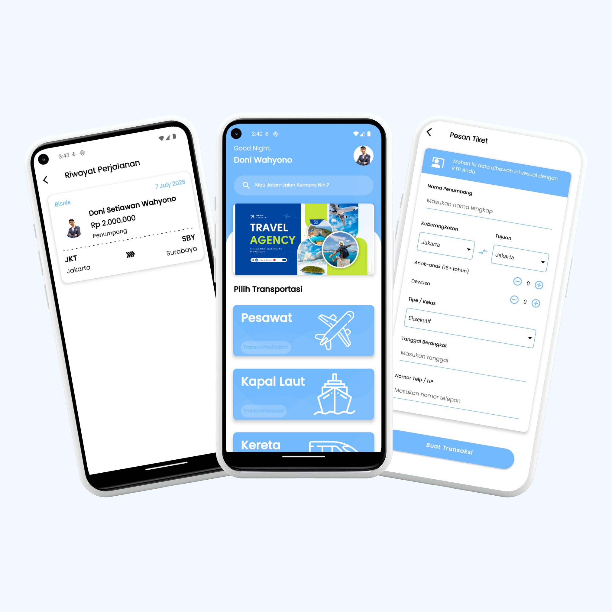
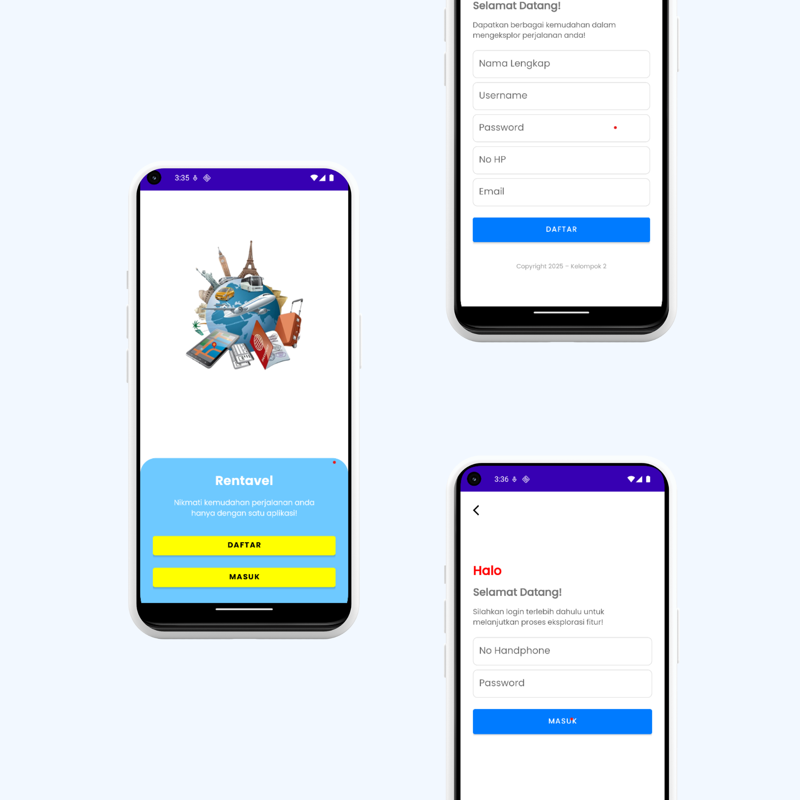

# ✈️ Aplikasi Pemesanan Tiket
**Project UAS Pemrograman Mobile 1 — Kelompok 2**

## 🧠 Deskripsi
Aplikasi *Pemesanan Tiket* adalah aplikasi Android yang dibuat untuk mempermudah pengguna dalam memesan tiket transportasi seperti pesawat, kereta, dan kapal. Aplikasi ini dikembangkan dengan arsitektur **MVVM**, menggunakan bahasa **Kotlin**, serta didukung oleh **Room Database** untuk manajemen data lokal.

## 👨‍👩‍👧 Anggota Kelompok
| Nama                      | NIM           | Peran               |
|---------------------------|---------------|---------------------|
| Doni Setiawan Wahyono     | 23552011146   | Full Stack Developer |
| Aisah Gandari Rahmah      | 23552011127   | UI/UX Designer       |
| Ariyan Kusharthanto       | 23552011168   | UI/UX Designer       |

## 🛠️ Teknologi & Library
- Kotlin
- MVVM Architecture
- Room Database
- Material Design Components
- ViewModel + LiveData
- RxJava3

## 📷 Screenshot Project

## 📌 Catatan
- Aplikasi ini hanya menyimpan data secara lokal (offline).
- Dibuat untuk memenuhi tugas akhir UAS *Pemrograman Mobile 1* semester 4.
